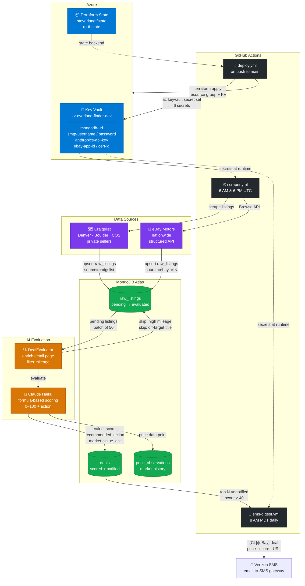

# OverlandFinder Architecture

## Component Summary

| Component | Role |
|-----------|------|
| **deploy.yml** | Terraform provisions RG + Key Vault; pipeline pushes all secret values |
| **scraper.yml** | Runs Craigslist + eBay scrapers twice daily, then evaluator until queue empty |
| **sms-digest.yml** | Sends top 3 unnotified deals via Verizon email-to-SMS at 8 AM MDT |
| **Key Vault** | Single source of truth for all secrets; never in Terraform state |
| **Craigslist scraper** | HTML scrape across Denver/Boulder/COS; pre-filters off-target titles |
| **eBay scraper** | Browse API; nationwide reach; VIN + mileage in structured response |
| **DealEvaluator** | Enriches detail pages, filters high-mileage, calls Claude per listing |
| **Claude Haiku** | Formula-based 0–100 scoring anchored to estimated market value |
| **MongoDB Atlas** | raw_listings → deals pipeline; price_observations for market history |
